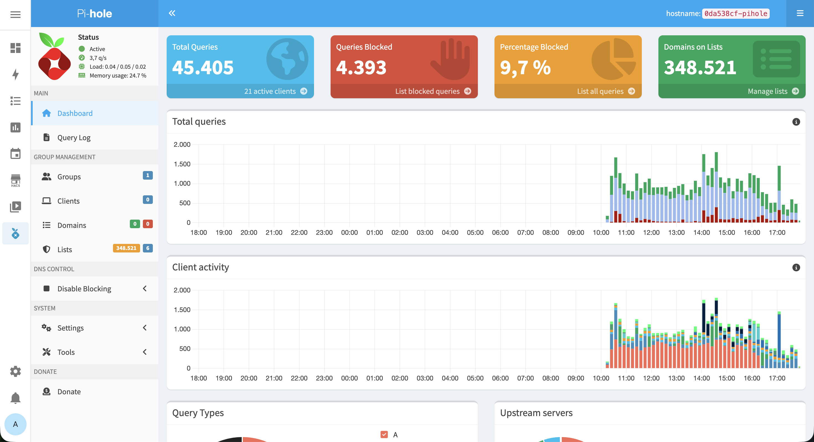

# Pi-hole Home Assistant Light Theme

A modern, bright theme for Pi-hole v6 that visually integrates with [Home Assistant](https://www.home-assistant.io/)'s light mode UI.

 



## Features

- Light sidebar (replacing the default dark `#222d32`)
- Primary color matched to Home Assistant's light blue (`#03a9f4`)
- Clean, modern look with soft grays and subtle hover states
- Material Design-inspired status colors
- Designed to feel at home next to Home Assistant's UI

## Installation

### Quick Install (via SSH)

Requires [Advanced SSH & Web Terminal](https://github.com/hassio-addons/addon-ssh) with **Protection Mode disabled** (for Docker access).

#### Download the theme
```bash
curl -o /homeassistant/pi-hole/high-contrast.css https://raw.githubusercontent.com/anwiese/pihole-homeassistant-theme/main/high-contrast.css
```

#### Backup the original
```bash
docker cp PIHOLE_CONTAINER:/var/www/html/admin/style/themes/high-contrast.css /config/high-contrast.css.bak
```
#### Install the theme
```bash
docker cp /homeassistant/pi-hole/high-contrast.css PIHOLE_CONTAINER:/var/www/html/admin/style/themes/high-contrast.css
```

Replace `PIHOLE_CONTAINER` with your Pi-hole container name. To find it:
```bash
docker ps --filter "name=pihole" --format "{{.Names}}"
```

### Manual Install

1. Download `high-contrast.css` from this repository
2. Copy it into the Pi-hole container:
   ```bash
   docker cp high-contrast.css PIHOLE_CONTAINER:/var/www/html/admin/style/themes/high-contrast.css
   ```

## Activation

After installing the theme:

1. In Pi-hole, go to **Settings → Web Interface - API Settings → Theme**
2. Select **"High contrast light"**
3. Clear your browser cache (`Ctrl+Shift+R`)

## Notes

- The theme replaces the built-in "High contrast light" theme since Pi-hole v6 does not support adding custom themes to the theme selector.
- The theme will be reset when the Pi-hole addon is updated or restarted. To make it persistent, re-run the install command after each restart or automate it via a Home Assistant shell command.
- Tested with [casperklein/homeassistant-addons](https://github.com/casperklein/homeassistant-addons) Pi-hole addon.

### Making it persistent (optional)

Create a Home Assistant shell command in `configuration.yaml`:

```yaml
shell_command:
  pihole_theme: >
    docker cp /homeassistant/pi-hole/high-contrast.css
    PIHOLE_CONTAINER:/var/www/html/admin/style/themes/high-contrast.css
```

Then create an automation that triggers on Home Assistant start:

```yaml
automation:
  - alias: "Apply Pi-hole theme on startup"
    trigger:
      - platform: homeassistant
        event: start
    action:
      - delay: "00:01:00"
      - action: shell_command.pihole_theme
```

## Restoring the Original

```bash
docker cp /config/high-contrast.css.bak PIHOLE_CONTAINER:/var/www/html/admin/style/themes/high-contrast.css
```

Or simply restart the Pi-hole addon.

## License

[EUPL-1.2](LICENSE) (matching Pi-hole's web interface license)
